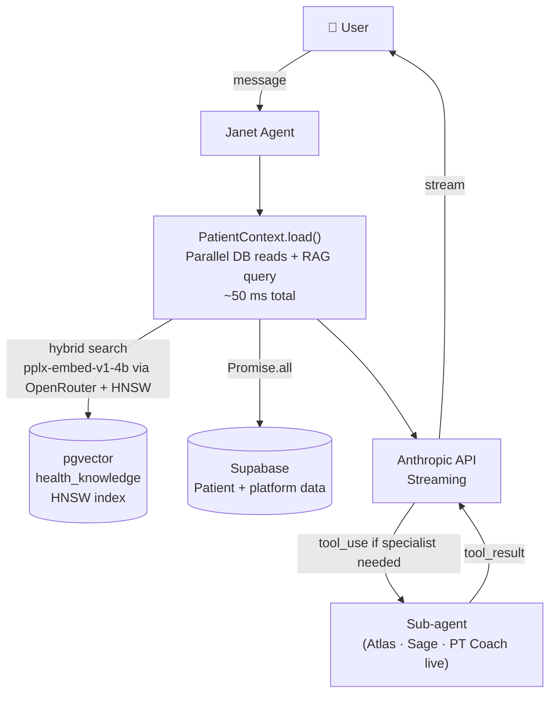
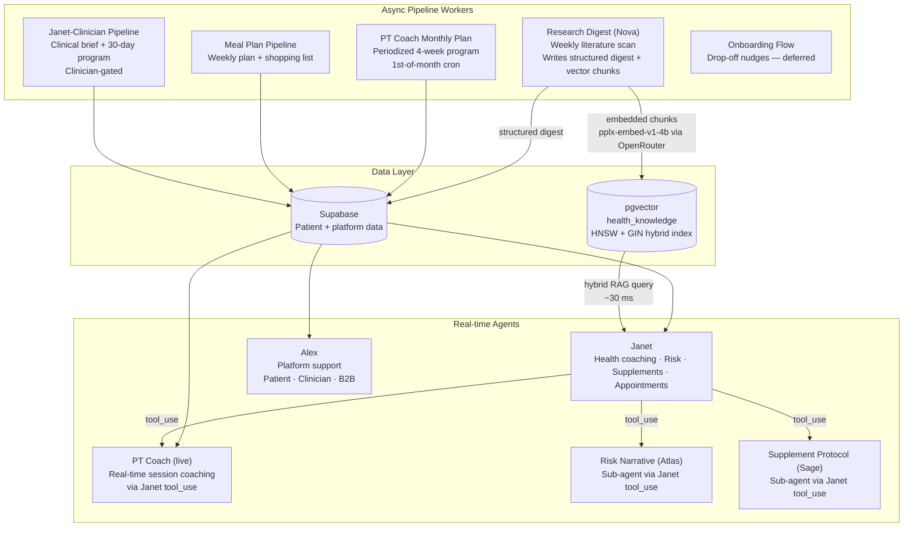

# Longevity Coach — Agentic System Vision

> For full component specs, build order, and implementation detail see [agent-system-design.md](./agent-system-design.md).

---

## What we're building

A multi-component AI layer on top of the existing patient data foundation. Patients complete onboarding → risk scores are generated → they can upload medical test results. The agentic layer makes that data useful in real time.

Two execution models:

- **Agents** — real-time conversational, stateful, streaming. One or two LLM calls per user message (the second only when a specialist sub-agent is needed).
- **Pipeline workers** — async, event or schedule triggered. Write structured output to DB so agents can read it at session start.

---

## Core pattern



- `PatientContext.load()` runs all DB reads and the RAG query in parallel — ~50 ms total.
- Sub-agent calls (Atlas, Sage, PT Coach) are real-time `tool_use` — the user waits; Janet synthesizes the result before streaming.
- Pipeline workers (Nova, PT monthly, Meal Plan, Janet-Clinician) run async in the background and write to DB. Janet reads their output at the next session start.

---

## System overview



---

## Research Agent (Nova) design

Nova runs separately from Janet. Its job is to maintain the knowledge base that Janet reads. It does not interact with users.

```mermaid
flowchart TD
    CRON["⏰ Weekly Cron"]
    NOVA["Nova Research Agent"]
    SEARCH["web_search × 6 categories\nPubMed · Nature · Cell · medRxiv · Cochrane\nAll in parallel — ~10 s"]
    FETCH["Fetch + extract articles\nParallel batches — ~25 s"]
    SYNTH["Synthesize per category\nLLM × 6 calls, 3 parallel — ~40 s"]
    CHUNK["Chunk digests\n400 tokens, 80 overlap"]
    EMBED["Batch embed\nvoyage-3-large 1024 dims\nSingle Voyage API call — ~20 s"]
    DB_STRUCT[("health_updates\nStructured digest display")]
    DB_VEC[("health_knowledge\npgvector — HNSW + GIN")]
    JANET["Janet\nReads RAG chunks\nat session start"]
    ADMIN["Admin / Clinician\nDashboard\nDigest display"]

    CRON --> NOVA
    NOVA --> SEARCH --> FETCH --> SYNTH --> CHUNK --> EMBED
    SYNTH -->|one row per digest| DB_STRUCT
    EMBED -->|3-5 chunks per digest| DB_VEC
    DB_STRUCT --> ADMIN
    DB_VEC -->|hybrid_search_health()| JANET
```

Target runtime: **< 200 s** — well within Vercel Pro's 300 s function limit.

---

## Design principles

| Principle | How |
|---|---|
| **Single cortex** | Every component uses the Anthropic Claude API. Context and tools wrap around it. |
| **Context at query time** | PatientContext loads fresh on every message via `Promise.all`. Never stale. |
| **Hybrid RAG for knowledge** | pgvector HNSW + BM25 full-text + RRF fusion. ~30 ms overhead. `perplexity/pplx-embed-v1-4b` via OpenRouter (2560 dims, 32K context, INT8, MRL) — same API key as all LLM calls. Janet always has current research. |
| **Real-time sub-agents** | Atlas, Sage, PT Coach live are invoked synchronously via `tool_use` when the user needs a specialist answer right now. |
| **Async pre-computation** | Monthly plans, meal plans, research digests, and clinical briefs run in the background. Agents read results at session start. |
| **One job per component** | Each pipeline or agent owns exactly one write target. No cross-component table writes. |
| **Persona-aware support** | Alex reads `profiles.role` at session start and switches mode — patient, clinician, or B2B. |

---

## Build order (P1 → P7)

```
P1  Supplement Protocol (Sage)    ← needs uploads infra + pgvector
P2  Risk Narrative (Atlas)
P3  Janet Agent                   ← needs P1 + P2 as real-time sub-agents
P4  Janet-Clinician Pipeline      ← needs clinician CRM portal
P5  PT Coach (live + monthly)  ┐
P5  Alex Support Agent         ┘  both need WhatsApp channels
P6  Meal Plan Pipeline
P7  Research Digest (Nova)        ← independent; feeds Janet RAG via pgvector

Deferred: Onboarding Flow (build when drop-off rate justifies it)
```
